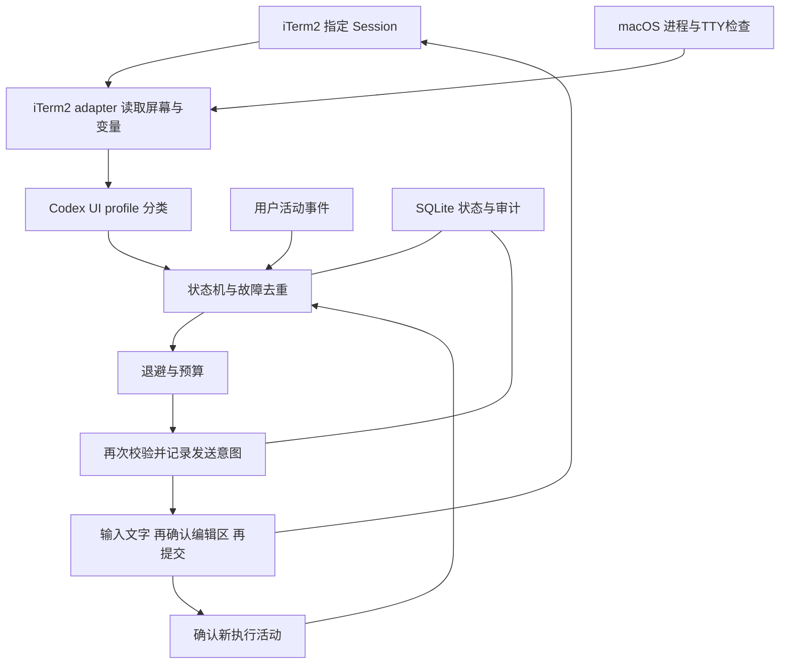

# CLIRetry：iTerm2 自动故障恢复工具设计与实施规范

> 文档版本：1.0 · 日期：2026-09-28  
> 交付类型：开发规格，不是已实现的软件或实测报告。  
> 目标读者：接手开发、测试和验收的工程师或大模型 agent。  
> 第一版范围：macOS、本机 iTerm2、已经运行的 Codex 交互式 CLI；通过 iTerm2 Python API 观察和定向输入，不改变 Codex 的启动方式。

## 0. 阅读约定与交付目标

本文中的 **MUST** 表示发布前必须实现或满足；**SHOULD** 表示推荐，但偏离时必须写明原因；“后续版本”不属于第一版交付。

第一版必须做到：用户在原有 iTerm2 会话启动 Codex，指定该会话开启监控；Codex 因可识别的容量不足、短时限流或连接故障停止后，工具按退避策略向同一会话输入一次“继续”并提交。工具不对正常结束、人工停止、权限确认、用户编辑中的输入框进行自动提交。

成功标准不是“调用发送 API 没有报错”，而是：

1. 有可追溯证据证明当前错误是新的、当前目标仍是绑定的 Codex、界面可接收恢复提示。
2. 同一个已处理的故障事件不会被重复提交。
3. 发送后观察到新的执行活动，或明确报告“未确认恢复”，不会盲目补发。
4. 无人值守期间持续观察新故障，并在次数、时间或能力边界处明确暂停。
5. 界面识别不可靠时能解释原因，不通过放宽所有保护条件让测试表面通过。

本文提供实现决定、接口契约、数据模型、规则、测试与验收顺序。标记为“实施时探测”的项目必须产生探测报告；不得将未验证的假设写成已支持。

## 1. 范围、限制与架构决策

### 1.1 第一版包含

- Python 3.11+；使用 `asyncio`、`dataclasses`、`enum`、`tomllib`、`sqlite3`、`logging` 等标准库。
- 运行依赖：`iterm2` Python SDK、`psutil`。开发依赖：`pytest`、`pytest-asyncio`；格式与静态检查工具可选。
- 一个本机 daemon 管理多个显式绑定的 iTerm2 Session，第一版默认最多 4 个。
- 枚举会话、能力诊断、只观察、开启自动恢复、暂停、恢复、停止、状态和日志命令。
- 首个 UI profile 面向本机实际使用的 Codex TUI；普通 shell、其他 CLI 默认不匹配。
- 容量不足、短时 429、明确的连接/流失败、明确的临时 502/503/504。
- 进程身份校验、输入框判定、历史基线、事件去重、指数退避、持久化发送意图、发送后确认。
- 离线屏幕 fixture 回放、模拟 API 故障、真实 iTerm2 隔离测试。

### 1.2 第一版不包含

- tmux 接入实现、远端 SSH 会话、iTerm2 tmux integration、Terminal.app、网页或 Cockpit 自带聊天窗口。
- 自动切换模型、账号或 API key；修改 Cockpit 路由、代理配置或供应商配置。
- 修改 Codex 源码、注入 Codex 插件、调用 App Server、读取认证文件或全量会话数据库。
- 自动重启 Codex、恢复崩溃进程、跨进程接管 thread、发送 `/goal resume`。
- 正常回合结束后持续催促、识别业务任务是否真正完成。
- 自动点击审批、发送确认选项、重试策略拒绝或“Trusted Access”等限制提示。
- 自动关闭窗口、激活窗口、抢占焦点、使用剪贴板、GUI 坐标点击或 AppleScript 按键模拟。
- 自动安装 launchd、修改 iTerm2/Codex 配置、升级 iTerm2、修改系统睡眠设置。

这不是承诺所有故障都能自动恢复。电脑睡眠、持久断网、余额耗尽、输入状态无法确认时，软件只能等待或暂停。

### 1.3 Cockpit 的适配边界

“由 Cockpit 启动”不等于需要单独识别 Cockpit。

| 实际运行形态 | 第一版处理 |
| --- | --- |
| Cockpit 配置环境后，在本机 iTerm2 启动原生 Codex TUI | 校验最终原生 Codex 进程和 TUI；通过则支持 |
| 启动包装脚本退出或等待，子进程是原生 Codex | 可以支持，但必须绑定实际 Codex PID，不能仅绑定包装脚本 |
| 前台实际是 Cockpit 自己的交互式 Node/Python 程序 | `UNSUPPORTED_PROCESS`；需要后续专用 profile |
| Cockpit 自己的 GUI/网页聊天 | 不在范围内 |
| iTerm2 内通过 SSH 或 tmux 运行 Codex | 不在范围内，不能放宽进程检查绕过 |

### 1.4 关键决定

| 决定 | 理由 |
| --- | --- |
| 新建 Python 工具，借鉴现有项目 | 保留用户启动习惯；现成 tmux 工具不直接覆盖本需求 |
| 只实现 iTerm2 adapter，核心不依赖 iTerm2 类型 | 便于以后增加 adapter，同时控制第一版规模 |
| 默认只观察，自动模式必须显式开启 | 开发和首次安装不会意外向真实会话输入 |
| 只处理明确的新错误，不以空闲时间触发 | 静默可能是长测试、等待外部事件或正常完成 |
| 不用 LLM 识别截图 | 不增加外部请求、费用、凭据或不稳定的决策层 |
| 错误识别使用文本、位置、样式、光标、前台进程的组合 | 单独正则无法可靠区分历史错误、引用和当前错误 |
| 不承诺 exactly-once | API 断线可能发生在发送已生效、确认未返回之间；通过不补发和暂停限制重复 |

## 2. 已核实能力与实施前置探测

### 2.1 调研事实

- 本次只读检查 `/Applications/iTerm.app/Contents/Info.plist` 得到本机 iTerm2 **3.4.23**。这不保证实际运行的一定是该安装副本，实施时需重新确认运行实例。
- 前序只读检查得到 PATH 中 `codex-cli 0.156.0`。包装器可能运行另一份二进制；最终以绑定进程为准。
- iTerm2 官方 API 支持按 Session ID 读取 mutable screen、光标、行信息和定向发送文字。[S1][S2]
- `async_send_text(..., suppress_broadcast=True)` 可避免本工具的文字被广播到其他 Session。[S1]
- 官方文档公开 `KeystrokeMonitor`、`VariableMonitor`、`Transaction`。[S3][S4][S5]
- 当前上游 SDK 源码具有 `LineContents.style_at(x)`、`CellStyle.faint`；`Session.async_get_screen_contents()` 在该源码版本请求样式。旧版宿主/SDK是否完整支持，必须实测。[S8]
- `jobName`、`jobPid`、`pid`、`tty` 是 iTerm2 Session 变量；其中 `pid` 是根进程，通常不是 Codex。`jobName` 在新版本中的子进程选择语义有变化，不能把它单独作为身份凭证。[S6]

**禁止假设** `session.is_idle`、`session.is_codex`、`session.input_is_empty`、`session.foreground_process` 等属性存在。业务状态全部由本工具生成。

### 2.2 P0：先探测，再完成自动发送实现

实现 `cliretry doctor --session <id> --json`，输出：

```json
{
  "schema_version": 1,
  "platform": "darwin",
  "iterm_app_version": "<actual>",
  "iterm_sdk_version": "<actual>",
  "session_found": true,
  "capabilities": {
    "read_screen": true,
    "read_cursor": true,
    "read_line_info": true,
    "read_cell_style": "unverified",
    "read_job_pid": true,
    "read_tty": true,
    "keyboard_monitor": "unverified",
    "transaction_read": "unverified",
    "suppress_broadcast": "unverified"
  },
  "automatic_ready": false,
  "blocking_reasons": ["CAPABILITY_NOT_VALIDATED"]
}
```

每项能力用 `true / false / "unverified"`，不得把 Python 方法存在当作宿主支持或行为正确。`doctor` 默认只读，不能测试发送。发送、广播抑制、键盘事件来源等行为在隔离测试中验证，结果记录到兼容性报告。

必须核实：

1. Python SDK 可以连接当前 iTerm2；首次系统授权由用户完成。未授权时输出具体操作指引，不绕过权限。[S7]
2. 屏幕读取在前台、非活动 tab、最小化、用户向上滚动时的语义。
3. 光标坐标的原点和与 mutable screen 的关系；宽字符、emoji、软换行正确映射。
4. `style_at()` 是不存在、无样式返回，还是可完整读取 faint 等属性。
5. `jobPid` 在原生 Codex、npm 包装器、工具运行期间、回到 shell 时的取值。
6. 本机 TTY 路径、`psutil`、`os.getpgid()` 和 `os.tcgetpgrp()` 是否可读。
7. `KeystrokeMonitor` 对真实键盘、粘贴、IME、脚本 `async_send_text()` 的行为；不能假定所有输入都有通知，也不能假定有可靠的事件来源字段。
8. `Transaction` 中预定使用的读取和发送 API 可正常完成；事务不能等待屏幕变化或用户事件。

### 2.3 旧版 iTerm2 的处理决定

- SDK缺少方法时，可以提出安装兼容 SDK 的实施步骤；不得自动升级宿主应用。
- **无样式能力**仍可支持“输入区所有单元格确实为空”的已验证布局。
- 若输入框有可见占位文字，而当前能力不能可靠区分占位文字与真实编辑内容，返回 `COMPOSER_UNVERIFIABLE`，只能观察。
- 不能用“占位文案相同”“光标在起始位置”代替样式证据：用户可以输入相同文案再按 Home。
- 如果本机 3.4.23 无法满足目标布局，P0报告必须指出具体缺失能力和验证过的升级候选；在用户决定升级前，不能宣称当前环境支持自动恢复。
- 兼容性报告以 `(macOS, iTerm2, SDK, Codex binary/version, UI profile revision)` 为一组。版本号是线索，fixture与实际行为才是依据。

## 3. 用户操作与 CLI 契约

以下命令是**待实现的接口约定**，现在还不能直接执行。

### 3.1 基本流程

```bash
# 在工具仓库安装到专用虚拟环境；不修改原有 Codex 安装
python3.11 -m venv .venv
.venv/bin/python -m pip install -e '.[dev]'

# 在独立终端启动观察服务；前台运行，Ctrl-C 停止服务
.venv/bin/cliretry daemon --config ./config.example.toml

# 在另一个终端控制服务
.venv/bin/cliretry sessions --json
.venv/bin/cliretry doctor --session '<ITERM_SESSION_ID>'

# 绑定当前已运行的 Codex；默认只观察
.venv/bin/cliretry watch --session '<ITERM_SESSION_ID>' \
  --profile codex-local-v1 --executable '<DOCTOR_REPORTED_NATIVE_CODEX_PATH>'
.venv/bin/cliretry status

# 显式开启该绑定的自动发送
.venv/bin/cliretry enable --session '<ITERM_SESSION_ID>'

# 暂停 / 重新观察 / 解除绑定 / 结束服务
.venv/bin/cliretry pause --session '<ITERM_SESSION_ID>'
.venv/bin/cliretry resume --session '<ITERM_SESSION_ID>'
.venv/bin/cliretry unwatch --session '<ITERM_SESSION_ID>'
.venv/bin/cliretry shutdown
```

- `daemon` 不启动 Codex、不改变 Codex 参数、不打开新窗口。
- `sessions` 返回 Session ID、窗口/tab定位、标题、jobName、是否支持；不返回完整命令行或终端全文。
- `watch` 必须唯一指定 Session ID。可提供 `--current` 便利参数，但只在调用时解析一次并打印实际ID；后续不跟随焦点。
- `watch` 只在原生 Codex 身份可确认时创建绑定；忙碌时身份不确定则要求稍后重试，不猜测。
- `enable` 必须完成能力、profile、身份校验，随后重建历史基线；默认不恢复开启前已显示的错误。
- `resume` 清除人工暂停/待确认状态但保留计数，进入 `OBSERVING`，始终是只观察；继续自动模式需再次 `enable`。
- `pause --all`、`status --json`、`unwatch --all` 必须支持。
- `unwatch` 仅取消监控，保留审计记录，不关闭 CLI。
- `shutdown` 只停止 CLIRetry；不能终止 iTerm2 或 Codex。

### 3.2 已经卡住时的显式一次性接管

基线策略会忽略启动监控前的旧错误，但用户需要能接管当前已卡住的会话：

```bash
cliretry inspect --session '<id>' --json
# 返回当前错误 evidence_token、身份摘要、所有阻止原因
cliretry retry-current --session '<id>' --evidence '<token>'
```

- `retry-current` 是显式请求的一次恢复，允许在观察模式执行，但不自动启用后续监控发送。
- token由daemon签发，绑定 daemon instance、Session、进程身份、profile revision、screen generation和当前错误摘要，60秒内必须提交请求，单次消费；客户端不能自行构造。
- 请求被接受时原子消费token并生成一次性authorization，随后允许按退避等待；不是要求整个退避在60秒内完成。authorization只对当前event有效，任何证据失效、用户操作、pause、断线或重启均撤销；不能转用于下一个event。
- 仍然执行全部身份、输入、菜单、用户活动、预算、退避、发送和确认流程；它只绕过“错误必须发生于开启监控之后”的限制。
- token过期、相关屏幕证据/身份/模式发生变化、已暂停或预算耗尽时拒绝；单纯采样seq增加不会令相同证据token失效。不能使用 `--force` 绕过。
- 拒绝不是API错误时，返回阻止原因并不发送。

### 3.3 控制接口

- daemon是唯一持有 iTerm2 连接和发送权限的进程，CLI客户端通过 Unix domain socket 与其通信。
- 路径固定为 `~/Library/Application Support/CLIRetry/control.sock`，目录权限0700、socket0600；启动时检查 AF_UNIX 路径字节长度，不支持时输出 `SOCKET_PATH_TOO_LONG`，允许显式指定用户拥有的短目录。
- 一个用户只允许一个标准实例；使用固定状态目录的 `fcntl.flock(LOCK_EX|LOCK_NB)`，不能仅凭PID文件判断。
- 协议：UTF-8 JSONL，每请求一个对象、一个响应，最大64KiB；字段 `v, request_id, command, args`。
- 响应字段 `v, request_id, ok, result, error`；未知命令/字段必须拒绝，不执行动态Python、shell命令或任意配置代码。
- 验证socket所属用户；客户端超时不会自动重放任何有副作用的命令，使用request_id查询结果。
- daemon只有在确认旧锁未占用、旧socket连接失败、文件类型和属主符合预期后才能清理失效socket。
- 退出码：0成功，2参数错误，3daemon不可用，4保护条件拒绝，5运行/API错误，6能力不支持。

## 4. 模块与目录

```text
CLIRetry/
├── DESIGN_IMPLEMENTATION.md
├── README.md
├── pyproject.toml
├── config.example.toml
├── src/cliretry/
│   ├── __init__.py
│   ├── cli.py                  # 命令、JSONL控制客户端
│   ├── daemon.py               # 生命周期、单实例、控制socket、任务调度
│   ├── config.py               # TOML加载、严格校验
│   ├── models.py               # 不依赖SDK的数据类型
│   ├── engine.py               # 纯状态转换；输入事件，输出动作
│   ├── scheduler.py            # 时钟、退避、预算、全局发送间隔
│   ├── evidence.py             # 基线、故障代次、去重和摘要
│   ├── sender.py               # 两阶段输入、持久化意图、确认
│   ├── store.py                # SQLite事务与审计
│   ├── logging_setup.py        # 元数据日志、轮转
│   ├── adapters/
│   │   ├── base.py             # TerminalAdapter协议
│   │   ├── iterm2_adapter.py   # 唯一导入iterm2的业务模块
│   │   └── process_macos.py    # psutil与TTY身份校验
│   └── profiles/
│       ├── base.py             # UiProfile协议
│       └── codex_local_v1.py   # 位置、样式、错误与输入区规则
├── tests/
│   ├── fixtures/codex_local_v1/
│   ├── unit/
│   ├── integration/
│   └── live/
├── tools/
│   ├── capture_fixture.py     # 显式读取选定会话并脱敏保存
│   ├── replay_fixtures.py
│   └── fake_codex_tui.py      # 隔离PTY验证，绝不用于生产进程白名单
└── docs/
    ├── COMPATIBILITY.md
    ├── OPERATIONS.md
    └── TEST_REPORT.md
```

不需要Web服务、容器、数据库服务或LLM服务。只有SQLite本地文件和Unix socket。



## 5. 数据模型与内部接口

### 5.1 必须定义的数据类型

建议使用不可变 dataclass；时间、坐标、布尔不使用含义模糊的字符串。

| 类型 | 必须字段/意义 |
| --- | --- |
| `SessionRef` | `session_id, window_id, tab_id, title`；后三项仅展示 |
| `ProcessIdentity` | `iterm_pid, iterm_started_at, root_pid, root_started_at, codex_pid, codex_started_at, exe_realpath, exe_device, exe_inode, exe_sha256, tty_path, tty_rdev, pgid, uid` |
| `Capabilities` | 各项探测结果、宿主/SDK版本、发送验证记录与profile兼容性 |
| `Cell` | 终端单元格坐标、`text, faint: bool|None, fg, bg`；无样式是None不是False |
| `ScreenFrame` | `session_id, connection_epoch, seq, monotonic_at, wall_at, width, height, cursor_x, cursor_y, lines, hard_eols, cells, absolute_top, first_visible_line, selection_length, variables, activity_seq` |
| `Observation` | `ui_state, composer_state, profile_revision, terminal_event, busy_evidence, menu_evidence, layout_signature, relevant_hash, blockers` |
| `FailureEvent` | `event_id, generation, category, signature, first_seen_mono, last_seen_mono, retry_after_s, source_seq, identity_hash` |
| `Binding` | `binding_id, session_ref, identity, profile_id, mode, state, enabled_at, baseline, generation, pending_event, counters, last_activity_seq` |
| `SendAttempt` | `attempt_id, event_id, binding_id, phase, reserved_at, text_ack_at, enter_ack_at, outcome, exception_code` |

`ui_state`：`BUSY / READY_ERROR / IDLE / MENU / UNKNOWN`。

`composer_state`：`EMPTY / PLACEHOLDER / USER_TEXT / UNKNOWN`。

`mode`：`OBSERVE / AUTO`，与运行状态分开保存。`EMPTY`或经证实的`PLACEHOLDER`才可开始发送。

`relevant_hash` 包含当前错误区、输入区、菜单区和必要footer结构，排除已明确识别的时钟/闪烁光标等装饰；不能笼统忽略所有变化。

### 5.2 Adapter契约

```python
class TerminalAdapter(Protocol):
    async def list_sessions(self) -> list[SessionRef]: ...
    async def probe(self, session_id: str) -> Capabilities: ...
    async def capture(self, session_id: str) -> ScreenFrame: ...
    async def identity(self, session_id: str) -> ProcessIdentity: ...
    def activities(self, session_id: str) -> AsyncIterator[ActivityEvent]: ...
    async def guarded_type(self, request: TypeRequest) -> TypeReceipt: ...
    async def guarded_submit(self, request: SubmitRequest) -> SubmitReceipt: ...
    async def close(self) -> None: ...

class UiProfile(Protocol):
    def classify(self, frame: ScreenFrame) -> Observation: ...
    def compare(self, previous: Observation, current: Observation) -> EvidenceDelta: ...
    def verify_typed_text(self, frame: ScreenFrame, text: str) -> bool: ...
```

- `guarded_type/submit` 必须在adapter内重新读取并校验，调用方不能传一个过期的 `safe=True`。
- 请求必须携带expected identity、profile revision、event token、activity_seq及快照代次；不匹配返回拒绝原因。
- `engine.reduce(binding, event, now)` 是纯函数，输出新状态与动作列表；不读SDK、时钟、文件、随机数或网络。
- 所有时钟通过 `Clock` 注入；随机抖动通过 `RandomSource` 注入，便于确定性测试。
- 内部异常分为 `ConnectionLost / SessionGone / IdentityChanged / CapabilityMissing / SnapshotInvalid / GuardRejected / SendOutcomeUnknown / StoreUnavailable`。

## 6. 目标绑定与macOS进程校验

### 6.1 身份规则

Session ID只定位终端，不能证明终端里仍是Codex。每次发送文字、每次提交Enter前都必须校验：

1. iTerm2实例PID及创建时间未变；Session ID仍存在且不是buried session。
2. Session根进程PID及创建时间未变；TTY仍是同一设备。
3. 绑定的原生Codex PID仍存在、创建时间一致、UID是当前用户；拒绝zombie/dead。
4. 实际可执行文件路径等于配置允许的**具体绝对路径**；绑定时记录真实路径、文件stat和SHA-256。
5. 发送前检查进程实际路径和文件stat未变；二进制被升级、替换或路径不可读则重新绑定，不能只信任文件名`codex`。
6. Codex进程的terminal与Session的TTY一致。
7. TTY前台进程组等于绑定Codex的进程组。
8. 当前 `jobPid` 对应绑定Codex，而不是shell、编辑器、ssh、tmux或其他程序。若旧版iTerm2将辅助进程报告为jobPid，第一版只延迟，不放宽成“前台组里有Codex就行”。
9. 当前界面同时通过Codex UI profile和空输入框检查。

`jobName`、`commandLine`、标题、工作目录、进程名中包含`codex`只能帮助诊断，不能代替上述条件。明确禁止把所有`node`、`python`或shell进程加入允许列表。

配置允许路径由 `doctor` 展示候选、用户在 `watch --executable <absolute-path>` 或配置中明确指定。绑定后将路径和identity保存；不能自动扫描并批准其他可执行文件。`watch`对指定路径进行规范化和匹配，不执行该文件。

### 6.2 实现方式

- 使用 `psutil.Process(pid).create_time()/exe()/terminal()/uids()/status()`；每次最终检查重新构造或刷新对象，不复用过期缓存。
- 使用 `os.getpgid(codex_pid)`。
- TTY只允许真实 `/dev/ttys*` 字符设备，校验路径、属主、`stat.S_ISCHR`和设备号；使用只读、`O_NOCTTY`、非阻塞方式打开以调用 `os.tcgetpgrp(fd)`，随即关闭。不得读取输入流或写TTY。
- 若该方法在目标系统权限不足，返回 `FOREGROUND_UNVERIFIABLE`，不提权、不改TTY权限。
- `psutil`调用放在线程执行器中，外层限时1秒；并发数设上限，避免不可取消的工作线程不断累积。
- 每个快照可缓存身份诊断最多1秒；发送前使用未过期的独立检查，不能仅用polling缓存。
- 绑定和发送前stat变化导致 `IDENTITY_CHANGED`；不需要每次重新hash整个二进制。

操作系统进程切换和iTerm2 API发送不能组成一个跨系统原子事务。以上规则缩小竞争窗口，但不提供对恶意进程/任意瞬间退出的绝对保证；该限制必须写入README，不得声称“绝不可能输到shell”。

## 7. 屏幕采集与界面识别

### 7.1 采集策略

第一版采用**定时polling为主、键盘事件为辅**，不依赖ScreenStreamer事件完整性。

- 默认每2秒采集一个Session；最多4个绑定。只读取mutable screen，不扫描整个历史。
- 发送准备和发送确认期间可暂时提高到250毫秒一次；每个Session只有一个采集任务，避免重复RPC。
- 每个RPC超时2秒；同一Session采集不允许重叠。
- 捕获geometry、屏幕行、`hard_eol`、单元格样式、光标、line info、selection length、必要Session变量。
- 多步screen/line info读取在短 `iterm2.Transaction(connection)` 中完成，并用整个daemon共享的 `iterm_transaction_lock`串行化；SDK事务不能并发嵌套。
- 事务内只做已验证的同步返回RPC与小量内存计算，不sleep、不等待屏幕事件、不做磁盘fsync、进程扫描或网络请求；目标耗时小于250毫秒。
- 第一版默认尺寸范围为80–240列、20–100行；超出配置范围返回 `GEOMETRY_UNSUPPORTED`，不能截断后继续判安全。实际profile覆盖范围须在兼容性报告列明。
- 窗口大小变化、absolute line计数回退、清屏、连接代次改变均使待发送证据失效并重建基线。
- 当 `first_visible_line` 表明用户向上滚动、存在selection或信息不可确认时，不发送；用户回到底部后仍需重新观察当前事件，不能立即执行过期timer。

### 7.2 规范化规则

1. 保留原始物理行、单元格、样式和坐标，另建逻辑行视图。
2. 只有 `hard_eol=False` 才连接下一物理行；保留逻辑文本到物理cell的映射。
3. 单元格索引不等于Python字符串索引。用SDK的 `string_at(x)` 构建映射，处理双宽字符、组合字符和空续格；越界/不完整信息产生UNKNOWN。
4. 不对所有行做 `strip()` 后再判断列零匹配；必须保留缩进，否则引用可能变成错误标题。
5. 不按“删除所有ANSI转义”处理SDK文本：SDK提供的是屏幕模型，不是原始PTY字节流。
6. 可以去掉完全空白的尾部行，但不能删除输入框中的空白编辑内容来伪造EMPTY。

### 7.3 Codex profile的解析顺序

`classify(frame)`按以下顺序执行，前面条件优先：

1. 不支持的尺寸、截断、样式缺失、未知布局 → `UNKNOWN`。
2. 活跃选择菜单、审批、确认、登录、模型选择、斜杠命令菜单 → `MENU`。
3. 当前输入区存在用户编辑内容 → `composer=USER_TEXT`。
4. 当前UI的运行/重连/工具执行区域满足busy结构 → `BUSY`。
5. 找到当前输入区，以及紧邻输入区上方的当前终态错误块 → `READY_ERROR`。
6. 可识别的普通空闲界面，无当前错误 → `IDLE`。
7. 其余 → `UNKNOWN`。

错误块与输入区之间只允许profile已列出的空行、分隔线和footer；中间出现新的正常回答、用户消息、工具结果或无法解释的内容，取消错误资格。

**每个profile必须包含真实fixture，不能靠本文给出的字符串推断完整布局。** 第一版只验收一种实际运行的Codex版本/布局组合；其他布局明确报告未验证。

### 7.4 输入框规则

输入框识别必须同时满足：

- 找到profile定义的prompt glyph（如`›`、`»`）及相邻结构；不是任意一行出现该字符。
- 光标位于该输入区，而非历史正文、菜单、搜索框。
- 多行编辑区完整可见，能确定每一行的归属。
- `EMPTY`：编辑区没有已写入文字，光标在已验证的空输入起始cell。若真实输入空格导致光标移动，不能当EMPTY。
- `PLACEHOLDER`：起始光标正确、所有非空占位cell符合已验证的占位样式、没有其他编辑行或粘贴附件标记。
- 缺少足够样式证据时，可见占位文字产生 `UNKNOWN`。RGB灰色本身不是通用占位判据。
- 图片附件、粘贴块摘要、多行隐藏内容、输入区被截断均返回 `UNKNOWN`。
- 不允许发送Ctrl-U、Ctrl-C、Escape清空输入框，也不允许移动光标来试探内容。

### 7.5 错误分类

以下文案仅是规则开发的种子，实际必须与捕获到的终态UI块进行完整匹配。只在profile定位的当前错误区域内使用正则，不能对整个屏幕直接搜索`429`或`error`。

| category | 种子/证据 | 默认动作 |
| --- | --- | --- |
| `CAPACITY` | `Selected model is at capacity. Please try a different model.` | 退避后恢复 |
| `RATE_LIMIT_TRANSIENT` | `exceeded retry limit, last status: 429 Too Many Requests`；没有quota/auth等更具体原因 | 退避后恢复 |
| `CONNECTION_TRANSIENT` | `stream disconnected before completion`、已确认终态的连接失败/timeout | 退避后恢复 |
| `STREAM_TRANSIENT` | `internal streaming error, please retry` | 退避后恢复 |
| `UPSTREAM_TRANSIENT` | 当前终态错误明确报告502/503/504或过载，并且没有更具体的不可重试原因 | 退避后恢复 |
| `USAGE_LIMIT` | 订阅窗口用尽、usage limit、明确下次恢复时间 | 第一版暂停并显示恢复时间，不自动等到恢复后继续 |
| `QUOTA_OR_BILLING` | `insufficient_quota`、credit/billing余额不足 | 暂停 |
| `AUTH` | 401、认证失效、登录要求、`auth_not_found`/无可用账号等明确配置问题 | 暂停 |
| `CONTEXT_LIMIT` | 上下文耗尽、压缩失败 | 暂停；不自动compact |
| `POLICY_OR_APPROVAL` | 策略拒绝、审批、Trusted Access、安全检查选项 | 暂停 |
| `UNKNOWN_ERROR` | 未列入允许集的错误 | 暂停并记录reason |

优先级：菜单/人工中断 > 明确auth/quota/policy/context原因 > 临时错误。HTTP状态码只是证据之一，例如503内含`auth_not_found`时不得归入普通临时503。

429不等于额度耗尽，也不等于必然可重试。第一版只对有明确临时限流语义或已验证的“重试耗尽429”终态块恢复；其余429归UNKNOWN。

`retry_after_s`只解析当前错误块中已验证的字段/句式，不虚构能读HTTP header。第一版只支持非负整数秒数或有明确时区的ISO8601时间；含糊的“明天3点”仅展示不用于自动调度。

自定义规则只允许本地配置的正则与类别映射，且仍经过同一套UI定位和保护条件；不能通过自定义正则覆盖菜单、认证、额度和人工停止。限制每个匹配字符串最长4096字符、规则数最多20；只允许内置审核过的模式或经过测试的本地规则，不接收外部输出动态下发的正则。

### 7.6 误报与不可观察性

终端文字不是结构化的服务端事件。工具输出可能包含看起来一模一样的错误示例，恶意输出甚至可以模拟UI；纯屏幕监控不能证明文本来源。

第一版必须通过位置、样式、完整布局、执行代次和进程校验降低普通误报；将引用、代码块、工具输出中的错误作为负例。不得宣称这是一条抵御任意终端输出欺骗的安全边界。

不读取Codex内部日志作为第一版必需条件，也不依赖“最近修改的会话文件”猜测thread。后续如果需要更强语义，可以另立App Server方案。

## 8. 基线、执行代次与故障去重

### 8.1 基线

`watch / enable / resume / reconnect / resize / clear-screen` 后先采集至少两个一致的有效快照，建立 `BASELINING`。基线期间不自动发送，已有错误都标为历史。

进入观察后，只有出现以下新证据之一，才能产生新的可恢复故障事件：

- 实际观察到profile确认的当前BUSY，随后进入新的READY_ERROR。
- 上一有效稳定快照无错误，之后出现完整的新终态错误；同时没有resize/clear/scroll/API gap等不连续现象，且错误块位置/内容变化可证明它是新渲染。
- 一次已提交的恢复在发送确认阶段观察到新执行/提交证据，之后出现新的终态错误。

同一错误一直停在原地、仅光标闪动、计时器更新、刷新两次，均不产生新事件。

### 8.2 代次与事件ID

- `generation`是本工具观察到的执行代次，不是Codex官方turn ID，文档和日志不得混淆。
- 代次只在确认新的执行启动/用户提交时增加；持续BUSY的每个采样不会递增。
- 只有错误文案hash不能去重：两次真实失败可能显示相同文案。
- 建议事件签名：`SHA256(identity_hash, connection_epoch, generation, rule_id, normalized_error_block, stable_error_anchor)`。
- `stable_error_anchor`可含absolute line位置，但不能单独依赖行号；inline redraw未必产生新行。
- `event_id`首次建立后持久化，在该事件期间固定。重复采样只更新last_seen。
- 已RESERVED、TYPED、SUBMITTING、SUBMITTED、UNKNOWN的event不能再次发送。
- 若快速失败完全发生在两次采样之间，屏幕恢复为完全相同状态且没有新执行证据，进入 `PAUSED_UNCONFIRMED` 或保持已消费状态；允许漏掉这次自动重试，不能假造“新事件”。

### 8.3 连续故障链

`failure_chain_id`从首次可恢复故障开始；后续失败即使类别不同也属于同一链，直到明确的正常空闲完成、人工重置或解除绑定。

- BUSY闪现不重置连续重试次数。
- 仅看到busy持续一段时间也不自动清零，避免恢复后再次失败形成无限重试。
- profile明确识别普通终态空闲、没有错误且稳定10秒，才结束故障链；这是重试计数的重置条件，不是“业务任务已完成”的判断。
- profile无法确认正常终态时保留计数，不影响用户手动操作。

## 9. 状态机与事件优先级

### 9.1 状态

| 状态 | 意义 | 是否可能发送 |
| --- | --- | --- |
| `BASELINING` | 建立基线、忽略既有错误 | 否 |
| `OBSERVING` | 正常观察，无待执行恢复 | 否 |
| `CANDIDATE` | 新错误已发现，等待稳定和保护条件 | 否 |
| `BACKOFF` | 已安排恢复时间，继续观察 | 否 |
| `PREPARING` | 持久化意图、最终身份与UI检查 | 通过检查后输入文字 |
| `VERIFYING_TEXT` | 等待界面准确显示本次文字 | 通过检查后提交一次Enter |
| `WAIT_ACK` | 已提交，等待新的执行证据 | 否 |
| `PAUSED_USER` | 用户操作、手动暂停或人工停止 | 否 |
| `PAUSED_BLOCKED` | 认证/额度/未知布局/预算等阻止 | 否 |
| `PAUSED_UNCONFIRMED` | 发送结果或恢复结果不明确 | 否 |
| `DISCONNECTED` | 无法连接iTerm2 | 否 |
| `TARGET_GONE` | 绑定进程或Session已结束/改变 | 否 |

`mode=OBSERVE`时最多走到BACKOFF并输出一次`would_retry`，随后返回OBSERVING并记下事件已报告；不能实际进入发送阶段、消耗生产预算或假装ACK。

### 9.2 主要转换

| 当前状态/事件 | 转换与动作 |
| --- | --- |
| 基线稳定且能力可读 | `BASELINING → OBSERVING` |
| OBSERVING出现新的可恢复错误 | `→ CANDIDATE`，记录event |
| 错误连续有效且稳定达到阈值 | `→ BACKOFF`，计算一次deadline |
| 仍在内置重试/BUSY | 取消待恢复；`→ OBSERVING`，保留故障链计数 |
| 正常新输出或错误不再是当前终态 | 取消pending；`→ OBSERVING` |
| deadline到达、全部检查通过、AUTO | `→ PREPARING` |
| 发送文字确认返回 | `→ VERIFYING_TEXT` |
| 输入区准确等于本次提示词，稳定且重新检查通过 | 提交一次Enter，`→ WAIT_ACK` |
| WAIT_ACK观察到明确新执行 | 将attempt标记RESUMED，`→ OBSERVING` |
| WAIT_ACK明确已提交但新一轮又失败 | 将attempt标记REFAILED，新event进入CANDIDATE；不重置计数 |
| WAIT_ACK超时或无法证明提交/执行 | `→ PAUSED_UNCONFIRMED` |
| 任意非终态收到用户活动 | 取消pending，`→ PAUSED_USER`；发送半途则保留已输入文字 |
| 任意状态检测进程/Session身份改变 | `→ TARGET_GONE`，需要重新watch |
| 任意状态发现阻断类别、预算耗尽 | `→ PAUSED_BLOCKED` |
| 发送前API断开 | `→ DISCONNECTED`，取消timer |
| 有未决发送时API断开 | 持久化UNKNOWN；重连后`PAUSED_UNCONFIRMED` |
| 无未决发送且同一iTerm实例重连 | 保留mode和预算，重新BASELINING；不恢复断线前pending |
| daemon自身重启 | 所有旧绑定mode设OBSERVE；未决发送进PAUSED_UNCONFIRMED，其余重新验证并BASELINING |

### 9.3 同时事件的优先级

每个Session由单一actor处理队列，禁止多协程直接修改Binding：

- actor只负责快速reduce与发起effect，不阻塞等待整个5秒文字确认、30秒ACK或长退避；effect结果回到队列后再转换状态。
- 单独设置 `RevocationLatch(activity_seq, cancel_version)`，由同一事件循环中的用户活动/控制命令接收回调立即单调递增，再入队正式事件。它不是可回滚的业务状态，也不能由effect降低。
- 每个发送effect持有启动时的latch版本，每次await后和每次调用输入API之前核对；即使pause事件尚未被actor处理，新输入也必须被拒绝。
- 控制面不能排在长时间effect之后才处理pause；pause响应要等撤销latch已生效，并报告正在执行的RPC，而非等待ACK超时。

业务事件处理优先级：

1. shutdown/unwatch/pause、身份失效。
2. 用户活动、菜单/审批、不可重试错误、连接不连续。
3. 新屏幕导致旧证据失效。
4. 发送回执和执行确认。
5. 退避timer到期。

timer携带 `(binding_id, connection_epoch, event_id, schedule_version)`；任一不匹配立即丢弃。`pause`增加schedule_version，旧timer不可重新激活工作。

### 9.4 人工活动

- 只订阅被绑定Session的 `KeystrokeMonitor`，不记录具体键入内容；只维护activity_seq和时间。
- 任何可确认的用户键盘操作取消当前待发送，并进入PAUSED_USER。Escape/Ctrl-C同样暂停，不能把人工停止当故障。
- 粘贴、IME、鼠标可能不产生同样的键盘通知；必须额外检查输入区变化、selection、scroll和菜单。
- 检测到输入区中出现不属于本次自动输入的内容，也进入PAUSED_USER。
- 不用“发送后的500毫秒内忽略全部键盘事件”之类时间窗口，否则会忽略真实用户。
- 若SDK无法区分自动send与真实键盘事件，按隔离测试结果选择：证实自动send不会产生monitor事件则正常使用；不能证实则停止自动发送支持，不伪造来源标记。
- 进入PAUSED_USER后不因用户闲置30秒自动恢复，必须由CLI `resume`/`enable`显式操作。

## 10. 退避、预算与时钟

### 10.1 默认参数

| 参数 | 默认值 | 约束 |
| --- | --- | --- |
| `poll_interval_s` | 2 | 0.5–30 |
| `stable_error_s` | 6 | 至少两个快照；计时连续 |
| `builtin_retry_grace_s` | 10 | 从最近一次观察到BUSY结束或新错误首次发现开始 |
| `backoff_base_s` | 30 | 大于0 |
| `backoff_multiplier` | 2 | 1–4 |
| `backoff_cap_s` | 900 | 不小于base |
| `jitter_fraction` | 0.2 | 0–0.5，仅增加等待 |
| `global_min_attempt_gap_s` | 15 | 跨Session的新attempt间隔 |
| `max_attempts_per_chain` | 12 | 1–100 |
| `max_chain_elapsed_s` | 7200 | 包含退避、等待确认和失败间的执行时间 |
| `max_attempts_per_session_hour` | 30 | 滚动3600秒窗口，不是整点重置 |
| `max_attempts_per_run` | 100 | 本次显式enable运行范围，跨服务重启不清零 |
| `max_enabled_duration_s` | 43200 | 12小时；到期暂停，作为明确的整夜运行上限 |
| `text_min_settle_s` | 0.5 | 文字输入后最小等待时间 |
| `text_confirm_timeout_s` | 5 | 等待准确显示文字的最大时间 |
| `recovery_ack_timeout_s` | 30 | Enter后确认开始新执行的最大时间 |
| `api_timeout_s` | 2 | 单个RPC超时 |
| `process_check_timeout_s` | 1 | 进程检查超时 |
| `sleep_gap_threshold_s` | 15 | 调度不连续检测阈值 |

第n次attempt，n从1开始：

```text
nominal = min(backoff_cap_s, backoff_base_s * multiplier ** (n - 1))
local_delay = min(backoff_cap_s, nominal * (1 + U(0, jitter_fraction)))
not_before = max(
    event.first_seen + stable_error_s,
    latest_busy_end_or_error_first_seen + builtin_retry_grace_s,
    event.first_seen + local_delay,
    event.first_seen + server_retry_after_s,  # 仅当可靠解析时
    global_last_attempt_time + global_min_attempt_gap_s
)
```

- 对本地退避设cap，但不能把更长的服务端等待时间截断成900秒。
- schedule创建时只抽一次随机数，轮询不重新抽样、不不断向后推deadline。
- `server_retry_after_s`起点为首次观察该错误的时间，因此可能多等一些，不会因已经展示了一段时间而提前重试。
- 等待会越过运行/链时间上限时，提前暂停并显示原因，不忽略预算。
- 原因分类变化不清除链计数。
- 预算在持久化RESERVED时保守扣除；后续因guard取消也不自动返还，避免崩溃和重试造成计数歧义。
- 临时身份忙碌等guard不通过时，应先等待，不要不断建立RESERVED尝试消耗预算。
- 多个Session同时到期按deadline、binding_id稳定排序；全局间隔在创建RESERVED时原子检查和占用。

### 10.2 预算生命周期

- `pause/resume/enable`均不自动重置已有run计数；首次enable或首次接受retry-current时建立run_id。一次性恢复也消耗相同run/hour/chain预算，不改变OBSERVE模式。
- run到期/预算耗尽后，只有显式 `cliretry reset-budget --session <id>` 才建立新的run并清零run/chain计数，操作后保持OBSERVE。
- reset不删除最近一小时的attempt记录，也不清除已消费事件；防止用重置重复同一故障。
- `unwatch`后重新绑定相同进程，最近一小时计数按 `(iterm incarnation, codex PID, create_time)` 继续约束；不能通过binding ID变化绕过。
- 每次reset写审计日志。第一版没有自动预算重置timer。

### 10.3 时间与睡眠

- 当前进程内的deadline使用单调时钟，日志时间用UTC wall clock；不把monotonic值直接跨重启复用。
- 保存墙钟时间与剩余预算用于重启恢复；如果墙钟明显回拨、UTC记录矛盾，暂停并要求人工检查，不假装预算已过期清空。
- 用采样间隔和wall/monotonic差值检测长时间停顿；必要时接系统唤醒事件作为补充，但不引入必需GUI权限。
- 检测sleep/wake或事件循环长暂停后，取消所有pending timer、增加schedule_version、进入BASELINING；不能在唤醒瞬间补发一批过期“继续”。
- 有未决发送时经历睡眠，转PAUSED_UNCONFIRMED。
- 脚本不能在系统睡眠时运行。OPERATIONS必须说明接电与睡眠设置的影响，不自动替用户修改系统偏好。

## 11. 两阶段发送与恢复确认

### 11.1 发送前检查表

只有以下全部为true才创建attempt：

```text
明确授权：AUTO，或有效的一次性retry-current
绑定有效：Session、iTerm实例、Codex进程、TTY身份一致
能力有效：此宿主/SDK/profile组合通过发送门槛
证据有效：新错误或显式指定的当前错误、非历史、未消费
UI有效：完整已支持布局、无菜单/审批/BUSY、空编辑区
活动有效：没有新用户活动、没有selection/scroll阻止
时间有效：退避、服务端等待、全局间隔都已到期
预算有效：chain/hour/run/duration全部允许
持久化有效：数据库可写并且唯一发送意图可提交
```

检查理由必须是枚举reason code，不只是`unsafe`。

### 11.2 实际流程

1. Session actor取得自身send lock，确认没有另一个attempt。
2. 执行新一次进程身份检查和screen分类；未通过则不创建attempt。
3. SQLite事务：占用预算与全局间隔，创建唯一RESERVED，写入attempt_id、event_id、预期身份、prompt hash、activity_seq；提交成功后才能调用输入API。
4. 立即再次检查进程；获取全局iTerm事务锁。
5. 在短 `Transaction(connection)` 内，重新读取当前jobPid/TTY、screen、输入区；确认身份摘要、错误签名、activity_seq、schedule_version、mode仍符合预期。
6. 调用 `session.async_send_text(prompt, suppress_broadcast=True)`，**只发送文字，不带换行**。首版默认prompt是`继续`。
7. 退出事务，记录TYPED；进入VERIFYING_TEXT。若RPC异常或记录失败，结果视为UNKNOWN并暂停。
8. 在事务之外等待至少500毫秒，并读取最多5秒；需要两个间隔至少250毫秒的有效快照，输入区准确等于本次prompt，光标位于末尾，无其他编辑内容、附件、菜单或新增用户活动。
9. 再次做新进程身份检查；将attempt标记SUBMITTING并持久化。
10. 在新的短iTerm事务中重新读screen/variables，复核上述条件，调用 `async_send_text("\r", suppress_broadcast=True)` **一次**。
11. 记录SUBMITTED；进入WAIT_ACK并持续观察最多30秒。

不得把两次send合并成 `prompt + "\n"`，也不得在事务内sleep后等待CLI渲染。Codex对快速输入的处理必须通过真实UI测试确认；0.5秒只是初始值，不是通用保证。

第一版先用短文本的两阶段发送。不默认加入bracketed-paste控制字符；若实际Codex组合必须使用该方式才能可靠提交，作为profile的显式、已验证发送策略补充，并增加测试。不能同时盲试多种Enter序列。

### 11.3 VERIFYING_TEXT失败

- 输入区始终没有显示prompt、显示成粘贴块、字符不完整、被用户编辑、光标不在末尾：不发送Enter，PAUSED_UNCONFIRMED或PAUSED_USER。
- 保留已经输入的文字，供用户查看。禁止Ctrl-U清理，因为清理本身也可能作用于错误对象。
- 用户在文字输入后按Enter，若monitor观察到用户活动，停止自动提交；由用户这次提交继续，不能补一个Enter。
- 期间出现新BUSY、菜单、审批、身份改变：终止attempt，不发送Enter。
- 只有文字完全匹配但不能确认由本工具输入，也不能忽略新增activity_seq。

### 11.4 ACK的严格定义

以下可以证明恢复开始：

- 在提交之后，profile识别到新一轮当前BUSY/Working状态，且不是历史正文中的文字。
- profile识别出新用户提交记录和新的助手/工具活动边界，发生在本次提交之后。

以下**不算**恢复成功：

- `async_send_text`返回成功。
- 输入框清空、光标移动、footer刷新。
- 错误文本消失，但没有新的执行证据。
- 只有新的用户消息回显，没有任何执行/失败响应。

若来不及看到BUSY，但观察到新的提交边界及紧接着的新终态错误，可标为REFAILED，产生新event。若内容完全相同且无提交/执行证据，保持不确定并暂停，不重复发送。

### 11.5 断线和崩溃语义

| 故障点 | 重启/重连后的动作 |
| --- | --- |
| RESERVED之前 | 重建基线，无发送意图可恢复 |
| RESERVED之后、文字调用之前，未能明确记录取消 | 保守视作未决，不重放 |
| 文字调用可能已到达，但返回丢失 | PAUSED_UNCONFIRMED；不再输入文字/Enter |
| TYPED之后、Enter之前崩溃 | PAUSED_UNCONFIRMED；保留文字，不自动提交 |
| Enter可能已到达，但返回丢失 | PAUSED_UNCONFIRMED；不补Enter |
| SUBMITTED后、ACK之前崩溃 | 只观察并报告未决；不重发 |
| RESUMED/REFAILED已持久化 | 事件保持已消费；重建基线观察未来新事件 |

完成用户级`pause`响应后，daemon不得再开始新的输入调用；已经在执行中的RPC可能已送达，暂停响应必须包含 `in_flight_attempt_id` 和已知phase，不能承诺撤回已经发送的字节。

### 11.6 调度伪代码

```python
async def handle_due(binding, timer):
    if not timer.matches(binding):
        return
    frame = await adapter.capture(binding.session_id)
    identity = await adapter.identity(binding.session_id)
    decision = guards.before_attempt(binding, frame, identity, clock.now())
    if not decision.allowed:
        return apply_block_or_cancel(binding, decision)
    if binding.mode == OBSERVE and not timer.explicit_one_shot:
        return record_would_retry_once(binding, timer.event_id)

    # reserve唯一键与预算检查在一个SQLite事务内完成。
    attempt = store.reserve(binding, timer.event_id, decision)
    try:
        receipt = await adapter.guarded_type(make_type_request(attempt, decision))
        store.mark_typed(attempt, receipt)
        proof = await verify_exact_composer_text(attempt)
        store.mark_submitting(attempt)
        receipt = await adapter.guarded_submit(make_submit_request(attempt, proof))
        store.mark_submitted(attempt, receipt)
    except GuardRejected as exc:
        # 若API调用未开始可记录取消；若已输入文字则暂停且保留文字。
        return cancel_or_pause_by_phase(attempt, exc)
    except Exception as exc:
        # 这里只做记录/暂停；绝不能catch后再次调用send。
        return mark_unknown_and_pause(attempt, exc)
    begin_ack_observation(attempt)
```

此伪代码省略actor队列与取消检查；实际代码必须在每个await后重新检查binding cancellation版本。持久化失败时全局关闭发送门，不允许日志异常吞掉后继续。

## 12. 配置规范

### 12.1 `config.example.toml`

```toml
schema_version = 1

[daemon]
max_sessions = 4
poll_interval_s = 2.0
api_timeout_s = 2.0
process_check_timeout_s = 1.0
state_dir = "~/Library/Application Support/CLIRetry"
# socket_path省略时是state_dir/control.sock

[recovery]
prompt = "继续"
stable_error_s = 6.0
builtin_retry_grace_s = 10.0
backoff_base_s = 30.0
backoff_multiplier = 2.0
backoff_cap_s = 900.0
jitter_fraction = 0.2
global_min_attempt_gap_s = 15.0
max_attempts_per_chain = 12
max_chain_elapsed_s = 7200
max_attempts_per_session_hour = 30
max_attempts_per_run = 100
max_enabled_duration_s = 43200
text_min_settle_s = 0.5
text_confirm_timeout_s = 5.0
recovery_ack_timeout_s = 30.0
sleep_gap_threshold_s = 15.0

[logging]
level = "INFO"
max_bytes = 5242880
backup_count = 5
capture_screen = false

[profiles.codex-local-v1]
# 首次部署由doctor展示实际原生可执行文件；watch --executable也可逐绑定指定。
# 空数组不授予任何可执行路径；watch需逐绑定传入--executable。
executable_paths = []
enabled_categories = [
  "CAPACITY", "RATE_LIMIT_TRANSIENT", "CONNECTION_TRANSIENT",
  "STREAM_TRANSIENT", "UPSTREAM_TRANSIENT"
]
min_columns = 80
max_columns = 240
min_rows = 20
max_rows = 100
```

### 12.2 配置行为

- `config.example.toml`必须可以用Python `tomllib`直接解析。
- 不提供配置级`auto_enable_all=true`；自动模式按Session显式开启。
- 不提供`ignore_process_check`、`ignore_composer`、`force_retry_all_errors`等绕过选项。
- 未知字段、类型错误、负时间、NaN/Infinity、矛盾的上下限，启动失败并精确指出键。
- prompt长度1–256 Unicode字符，必须单行；禁止CR/LF、ESC、C0/C1控制符。仅允许普通文本，不能以`/`开头变成CLI命令。
- `state_dir/socket_path`只展开用户主目录，不执行shell变量替换或命令替换；解析后检查属主和权限。
- executable_paths必须是存在的本地常规可执行文件绝对路径，解析symlink后再绑定；空列表不等于允许任何进程。
- enabled_categories只能是支持的临时类别子集，不能把AUTH/POLICY等加入。
- 第一版配置在启动时加载，不做热更新；变更后重启会进入只观察，用户再enable。
- 第一版只接受`capture_screen=false`，设true时报配置错误。诊断捕获必须显式调用capture工具，普通daemon不持久化屏幕全文。
- `--json`输出稳定schema；所有人类文案变化不能破坏reason code契约。

## 13. 持久化、日志与重连

### 13.1 SQLite

路径 `state_dir/state.sqlite3`，0600；建议 `journal_mode=WAL`、`synchronous=FULL`、`foreign_keys=ON`、`busy_timeout=2000`。WAL/SHM文件同样限制访问。

最少表：

```text
schema_meta(version)
bindings(binding_id PK, session_id, identity_json, profile_id, profile_revision,
         mode, state, run_id, generation, schedule_version, updated_at)
runs(run_id PK, identity_hash, enabled_at_utc, expires_at_utc, attempt_count)
failure_chains(chain_id PK, binding_id, started_at_utc, attempt_count, closed_at_utc)
events(event_id PK, binding_id, chain_id, generation, category,
       signature, first_seen_at_utc, consumed, source_seq)
attempts(attempt_id PK, event_id UNIQUE, run_id, identity_hash,
         reserved_at_utc, phase, outcome, text_ack_at_utc, enter_ack_at_utc)
control_requests(request_id PK, command, result_json, created_at_utc)
audit(id PK, timestamp_utc, binding_id, event_id, attempt_id,
      action, reason_code, metadata_json)
```

- `reserve()`在一个事务内检查AUTO模式或有效的一次性authorization、事件未消费、预算、全局间隔，插入attempt并标记consumed、更新计数；冲突返回ALREADY_CONSUMED。
- 此处SQLite事务的模式检查与actor状态通过单一daemon写入顺序统一，不能让多个服务分别调度。
- 进程单实例锁和数据库UNIQUE约束都要保留：前者减少错误，后者限制重复。
- 关键审计和状态同事务提交；普通文本日志只是辅助，不是恢复依据。
- 数据库损坏、schema不兼容、磁盘满、权限错误：关闭发送，保留文件，不自动删除数据库或新建空库继续重试。
- 不存API key、进程环境、完整prompt历史或屏幕全文。
- 首版按启动时清理超过30天的已终结绑定及其关联历史；活跃/未决记录永不按日期清理。最近小时预算与run记录未过期前不可删除。

### 13.2 日志与状态

日志为JSONL，文件 `state_dir/logs/cliretry.jsonl`；轮转5MiB×5备份。每条至少有：

```json
{
  "schema_version": 1,
  "timestamp": "2026-09-28T01:00:00Z",
  "level": "INFO",
  "session_id": "<local-session-id>",
  "event_id": "<event-id>",
  "attempt_id": "<attempt-id>",
  "state": "BACKOFF",
  "action": "retry_scheduled",
  "reason_code": "CAPACITY",
  "attempt_in_chain": 2,
  "delay_s": 63.2
}
```

`status`至少展示：mode、state、目标身份摘要、profile、最近类别、下一次允许时间、链/run/hour计数、最近成功恢复时间、阻止原因、未决attempt。

必要reason code：

```text
CAPABILITY_NOT_VALIDATED, COMPOSER_UNVERIFIABLE, UNSUPPORTED_PROCESS,
PROFILE_MISMATCH, GEOMETRY_UNSUPPORTED, SNAPSHOT_DISCONTINUITY,
FOREGROUND_UNVERIFIABLE, IDENTITY_CHANGED, TARGET_GONE,
USER_ACTIVITY, COMPOSER_NOT_EMPTY, MENU_PRESENT, BUSY,
STALE_EVENT, ALREADY_CONSUMED, AUTH, USAGE_LIMIT, QUOTA_OR_BILLING,
CONTEXT_LIMIT, POLICY_OR_APPROVAL, UNKNOWN_ERROR,
CHAIN_BUDGET_EXHAUSTED, HOURLY_BUDGET_EXHAUSTED, RUN_BUDGET_EXHAUSTED,
RUN_EXPIRED, TEXT_NOT_CONFIRMED, SEND_OUTCOME_UNKNOWN, ACK_TIMEOUT,
API_DISCONNECTED, STORE_UNAVAILABLE, CLOCK_DISCONTINUITY
```

相同阻止原因不每2秒刷日志，只在状态变化或每60秒汇总一次；状态接口始终反映最新证据。

### 13.3 重连与任务监督

- iTerm2连接断开后按1、2、5、10、30秒封顶退避重连，持续到用户shutdown；每次失败最多写一条汇总日志。
- `run_until_complete(..., retry=True)`的文档只说明连接重试，不能假设它自动恢复业务订阅和状态。实现必须显式重建App、Session对象和monitor订阅。
- daemon监听socket应在无iTerm2连接时继续响应status/pause/shutdown。
- 每个Session任务异常必须上报supervisor并暂停该绑定，不能静默死亡；共享连接/数据库异常影响所有发送。
- 新连接增加connection_epoch；所有旧timer、旧Session对象、旧screen失效。
- 同一iTerm2实例且身份完全一致时允许保留AUTO模式重新BASELINING；新iTerm2实例或新Codex进程不得自动重新绑定。
- 连接断开时关闭未完成monitor，避免同一Session重连后出现多个订阅。
- SIGINT/SIGTERM：停止接收新恢复任务，取消timer，完成有界状态持久化，关闭连接/socket，释放锁。不要向Codex转发信号。

## 14. 测试数据、用例与验收

### 14.1 三层测试

**A. 纯逻辑离线测试（必需，无iTerm2、无模型调用）**

- FakeClock、确定性RandomSource、FakeTerminalAdapter、临时SQLite数据库。
- UI profile以fixture输入，engine以事件序列输入。
- 测试不能只断言内部函数调用；必须检查最终状态、实际发送序列、持久化记录和预算。
- `observe`模式在任意输入序列下发送次数必须为0。

**B. iTerm2隔离集成测试（必需，显式测试命令启动）**

- 使用专门的测试窗口/Session；脚本创建的对象要记录ID，结束只关闭自己创建的对象。
- 测试TUI渲染Codex捕获fixture，记录stdin收到的每个字节及其时间。
- fake程序在生产进程校验中必须被拒绝。测试通过依赖注入使用专门的FakeProcessProbe，不能给生产CLI增加`--skip-identity-check`。
- 独立测试真实macOS ProcessProbe：shell、原生Codex、后台进程、前台切换、PID变化；不能因为渲染了Codex界面就通过身份检查。
- 集成测试需验证真实SDK事务、按键monitor、广播抑制、Unicode、延迟提交、断线处理。
- 不触碰用户已有Session，不读取它们的内容，除了用户明确选择用于fixture的目标。

**C. 目标版本的受监督验证（发布自动模式前必需）**

- 记录实际版本组合；使用无外部副作用的任务和专用会话。
- 验证本工具输入“继续”能够成为一条提交，而不是换行或停留在编辑框。
- 优先利用自然发生的临时故障验证；不通过大量请求故意触发真实429。
- 供应商故障可在模拟器中充分覆盖；报告必须分别列出“模拟通过”和“真实故障观察到通过”，不能混写。
- 当前iTerm2 3.4.23不支持关键能力时，报告限制，不能拿另一台新版本通过代替本机通过。

### 14.2 Fixture格式

每个fixture目录至少有：

```text
manifest.json       # 来源、版本组合、profile revision、捕获/脱敏说明
frames.jsonl        # 按序的ScreenFrame；含物理行、cell、样式、光标、hard_eol
events.jsonl        # 键盘活动、连接、进程身份、时钟推进等事件
expected.json      # 分类、状态变化、允许发送的准确序列和次数
```

`manifest`必须区分 `source="captured"` 与 `source="synthetic"`。删除真实路径/项目内容时要保持布局、字符宽度、错误结构和样式；改变后重新验证测试用途。不要自动保存真实会话全文。

最小事件回放示例（引用的是另存的完整快照，不以此替代屏幕数据）：

```json
{
  "name": "fresh_capacity_then_resume",
  "clock": "fake_monotonic",
  "jitter": 0,
  "timeline": [
    {"at": 0, "event": "frame", "fixture": "idle_001"},
    {"at": 2, "event": "frame", "fixture": "idle_001"},
    {"at": 4, "event": "frame", "fixture": "busy_001"},
    {"at": 8, "event": "frame", "fixture": "capacity_empty_001"},
    {"at": 14, "event": "frame", "fixture": "capacity_empty_001"},
    {"at": 38, "event": "due"},
    {"at": 38.5, "event": "frame", "fixture": "capacity_typed_continue_001"},
    {"at": 38.75, "event": "frame", "fixture": "capacity_typed_continue_001"},
    {"at": 40, "event": "frame", "fixture": "busy_002"}
  ],
  "expected": {
    "typed": ["继续"],
    "submitted": ["\r"],
    "attempts": 1,
    "outcome": "RESUMED"
  }
}
```

测试初始化需显式设置已通过能力探测、绑定mode=AUTO、合适预算和预期identity；不能让生产代码为了测试默认AUTO。

### 14.3 必须覆盖的回归矩阵

| ID | 场景 | 必须结果 |
| --- | --- | --- |
| T01 | 新capacity终态＋空输入框 | 等待后文字一次、Enter一次、ACK后RESUMED |
| T02 | 新429重试耗尽＋可靠retry-after=120 | 至少等120秒，不能按30秒发送 |
| T03 | 503内部包含auth_not_found | 暂停AUTH，不重试 |
| T04 | stream断开且已回到输入区 | 允许恢复 |
| T05 | 错误存在但仍显示内置重连/BUSY | 不发送 |
| T06 | 启动时已有capacity历史错误 | 不发送；有效retry-current可单次处理 |
| T07 | 同一错误保持10分钟、光标闪烁 | 最多一个attempt，不重复 |
| T08 | 恢复后看到BUSY，再出现相同capacity | 新event，退避递增 |
| T09 | 快速失败、画面完全相同且无新执行证据 | 不假造新event；暂停未确认 |
| T10 | 正常回答包含429或完整错误文案 | 不发送 |
| T11 | 用户prompt、引用、代码块、工具stdout含错误 | 不发送 |
| T12 | 正常回合结束并空闲一小时 | 不发送 |
| T13 | 用户已输入半句话、多行、空格或附件 | 不发送、不清除 |
| T14 | 用户输入与占位文字完全相同并按Home | 不得识别PLACEHOLDER |
| T15 | 样式API缺失且存在可见占位文字 | COMPOSER_UNVERIFIABLE |
| T16 | 无样式但profile确认真正空输入区 | 能按已验证能力路径处理 |
| T17 | 审批、模型菜单、斜杠菜单、搜索框 | 不发送 |
| T18 | deadline前用户按键或Escape/Ctrl-C | 取消timer，PAUSED_USER |
| T19 | 文字已输入后用户开始编辑或自行Enter | 不追加Enter，不清除文字 |
| T20 | Codex退出到shell，错误仍在屏幕 | TARGET_GONE，不输入 |
| T21 | 同一Session启动新的Codex | 旧绑定拒绝，需重新watch |
| T22 | PID复用、TTY变化、二进制替换 | 拒绝旧身份 |
| T23 | 普通node/python、ssh、tmux、编辑器 | 生产ProcessProbe拒绝 |
| T24 | Session切换、窗口重排、焦点变化 | 仍只定位原Session ID |
| T25 | iTerm2广播输入开启、另有测试Session | 本工具文字只到目标Session |
| T26 | 退避中断线并重连，旧错误仍存在 | 不执行旧timer，重新基线 |
| T27 | 在每个发送阶段注入崩溃/返回丢失 | 不重放，未决状态可查询 |
| T28 | 数据库满/损坏/只读、关键提交失败 | 不发送或立即停止后续提交 |
| T29 | 正常空闲、失败链切换、瞬时BUSY | 只在明确定义的正常终态条件下重置chain |
| T30 | chain/hour/run/duration任一到限 | 相应reason暂停，重启不清零 |
| T31 | 同时启动两个daemon | 第二个拒绝，不出现双发送 |
| T32 | 两个Session同时到期 | 全局15秒间隔生效，彼此计数隔离 |
| T33 | 缩放窗口、软换行、宽字符、emoji | 正确分类或UNKNOWN，不误判空输入 |
| T34 | 用户向上滚动、selection存在 | 不发送，旧pending被取消 |
| T35 | 电脑睡眠一小时后唤醒 | 不集中补发；重建基线 |
| T36 | 系统墙钟回拨、monotonic不连续 | 不提前发送或清空预算 |
| T37 | 两次真实失败文案相同但代次不同 | 不因文案hash相同永久漏掉后续失败 |
| T38 | Enter已送达但API返回丢失 | 不补Enter，PAUSED_UNCONFIRMED |
| T39 | sdk文字调用返回成功但没有执行ACK | ACK_TIMEOUT，不继续叠加prompt |
| T40 | observe模式回放全部正负案例 | 所有输入API调用次数为0 |
| T41 | 一次性token过期、复用、目标变化 | 拒绝；合法一次性请求不启用AUTO |
| T42 | 子任务抛异常或monitor订阅失效 | 状态可见、暂停受影响绑定，不静默放行 |
| T43 | pause与due/submit同时发生 | pause优先；在途状态明确，无新发送开始 |
| T44 | 程序自身send触发/不触发键盘通知的两种模拟 | 不以宽泛时间窗口忽略真实输入 |
| T45 | 连接在无新frame时保持正常 | 不依赖屏幕事件才推进timer；RPC复核后决策 |
| T46 | clone规则/原始参数包含shell元字符 | 不执行shell，控制协议拒绝非法字段 |

### 14.4 验收指标

- 上表所有离线可覆盖用例通过，隔离集成测试有具体运行记录。
- 正常完成、用户输入、审批、回到shell、历史引用、旧错误六大类负例：测试集内自动提交次数必须为0。
- 对有效新临时故障：每event最多一条恢复消息和一次Enter；后续独立event可按预算重试。
- 无jitter的FakeClock测试精确验证deadline；真实环境允许polling和RPC延迟，不允许早于deadline。
- 本机目标组合的可用性必须单列；只有能力检查通过、profile真实fixture通过、受监督发送通过，才能标记`automatic_supported=true`。
- 4个只观察会话连续运行2小时，无任务静默退出、无无限日志增长、无状态文件损坏；记录CPU/RSS，不凭空承诺CPU为0。
- 进行一次至少8小时的模拟故障耐久测试，覆盖断线、暂停、预算耗尽和重启。可以使用加速时钟覆盖逻辑，再以真实时间运行检查资源问题；两类结果分开记录。
- 自动发送未在本机通过时，交付物只能称“观察模式可用/自动模式待验证”，不能写“已完成无人值守恢复”。

## 15. 按阶段实施与交付物

### P0：环境与API能力验证

交付 `docs/COMPATIBILITY.md` 初稿、只读doctor、运行实例/SDK版本、各项能力true/false/unverified。

必须先解决本机旧版iTerm2的样式和jobPid问题。若关键能力缺失，继续完成可独立验证的观察/逻辑模块，同时明确需要的外部选择；不能未经用户同意升级软件。

### P1：可安装骨架与控制面

交付pyproject、CLI命令解析、daemon、单实例锁、Unix socket、TOML严格校验、SQLite迁移、元数据日志；此阶段没有任何生产发送调用。

验收：可安装、daemon能启动和关闭、iTerm2不可连接时status仍可用、双实例被拒绝、非法配置明确报错。

### P2：iTerm2只读adapter与身份绑定

实现会话枚举、捕获、profile数据转换、进程验证、watch/inspect/status、fixture捕获工具。

验收：真实iTerm2能观察指定Session；shell/ssh/tmux拒绝自动绑定；手动切换tab不改变目标；未绑定会话不被采集。

### P3：profile、状态机和调度

实现真实fixture解析、错误分类、输入区判断、基线、event generation、去重、预算与退避；输出 `would_retry`。

验收：T01–T46中所有与纯逻辑有关的部分通过；OBSERVE始终零发送；新旧错误清楚区分。

### P4：两阶段发送和崩溃一致性

实现guarded_type/submit、RESERVED→TYPED→SUBMITTING→SUBMITTED持久化、ACK、未知结果暂停。

验收：隔离TUI收到准确字节，广播不泄漏到其他Session；每个故障点注入后不重放；存储故障不能绕开保护。

### P5：目标Codex验证与文档

补齐真实profile和版本范围；在专用会话受监督验证容量/网络错误恢复，未能自然复现的类别清楚标模拟覆盖。

交付README、OPERATIONS、COMPATIBILITY、TEST_REPORT；执行耐久测试并记录结果。第一版完成前不得把实验性的宽松匹配设为默认。

### 开发agent执行约束

1. 先读取本文、仓库现状及适用的AGENTS.md，尊重已有用户修改。
2. 默认在观察模式实现和测试；开发请求不等于允许向当前真实工作Session发送文字。
3. 实现本文规定的接口，不把未实现命令留在README冒充可用。
4. 如需真实写入验证，使用明确指定的测试Session；不要自动枚举后选“看起来像Codex”的会话进行发送。
5. 不安装其他开源watchdog并同时运行，避免多个工具重复继续。
6. 无须并行agent；若任务上下文另行授权并行，按模块划分文件所有权。
7. 每阶段报告：改动文件、执行的测试、结果、仍未验证的版本/能力。
8. 发现本文与目标SDK实际能力冲突时，用源码/测试证据更新设计与兼容性报告；不能静默删掉保护条件。
9. 最终交付必须能从新虚拟环境安装，并按README完成“连接→观察→检查→显式启用→暂停”。
10. 自动模式不受支持时，说明具体阻止点和完成支持所需步骤，而不是宣布全部完成。

## 16. 操作手册必须包含的内容

### 16.1 安装与启动

- 明确Python和iTerm2 SDK版本，以及如何使用专用venv安装。
- 如何在iTerm2设置中允许Python API、处理首次授权；不同iTerm2版本菜单位置可能不同，以实际界面为准。
- 推荐先从独立终端以前台daemon运行，观察启动日志。
- 用户继续按原有方式启动Codex/Cockpit包装器，不强制tmux、别名或新的Codex启动命令。
- 第一版不提供静默开机自动发送；可在未来增加显式安装的LaunchAgent，但daemon重启默认OBSERVE规则保持。

### 16.2 每晚使用流程

1. 正常打开目标CLI；使用sessions找到确切ID。
2. doctor检查能力和进程；watch只观察。
3. 查看inspect与status，确认profile能解释输入区和当前状态。
4. enable开启指定Session；若已经卡住，用inspect签发token后retry-current处理当前错误。
5. 确认max_enabled_duration、run/hour/chain预算满足计划。
6. 次日查看恢复次数、失败类别、暂停原因和未决attempt；继续手动操作前pause或unwatch。

### 16.3 常见问题处理

| 状态/现象 | 操作建议 |
| --- | --- |
| 找不到Session | 查看sessions，重新指定完整ID；不按标题自动迁移 |
| COMPOSER_UNVERIFIABLE | 查看宿主/SDK样式能力和profile，保持观察；不关闭输入保护 |
| jobPid不是Codex | 检查是否仍在执行工具、是否包装器/ssh/tmux；等待或使用受支持形态 |
| TEXT_NOT_CONFIRMED | 查看输入框是否已有“继续”，手动处理后resume；不再次盲目输入 |
| ACK_TIMEOUT | 检查CLI是否已开始/再次失败；人工确认后resume/enable |
| AUTH/QUOTA | 用户处理认证/额度；本工具不修改账号 |
| RUN_EXPIRED/预算耗尽 | 查看审计，确需继续时显式reset-budget，再enable |
| 升级Codex后失效 | 重新doctor、采样profile和验证；不能仅修改版本白名单 |
| iTerm2重启 | 原身份失效，重新watch新的会话 |
| daemon崩溃后有未决attempt | 查看phase，不自动清库；人工检查输入区和执行状态 |

### 16.4 停止与卸载

- pause/shutdown都不会停止Codex工作；只是停止CLIRetry自动输入。
- 卸载前shutdown，确认daemon退出；卸载Python包或删除专用venv。
- 状态/日志目录默认保留供审计，明确列出路径；需要删除时由用户决定。
- 第一版不修改系统配置，所以不应出现需要回滚未知shell rc、iTerm2 profile或Codex配置的情况。

## 17. 尚需实测、不可伪装成确定结论的事项

| 待验证项 | 获取证据的方法 | 未通过时的行为 |
| --- | --- | --- |
| 本机iTerm2 3.4.23的单元格样式能力 | P0＋隔离带faint文字的TUI | 占位输入框仅观察 |
| 实际Codex输入框/错误边界 | capture真实fixture，包含正负样本 | PROFILE_MISMATCH |
| 包装器场景的jobPid及TTY关系 | 绑定进程只读探测 | UNSUPPORTED_PROCESS |
| 脚本send是否产生键盘monitor事件 | 隔离测试分别记录真实键盘和程序输入 | 未明确前禁用自动发送 |
| 输入中文、等待500毫秒、CR能否提交 | 隔离TUI＋受监督Codex | 不补Enter，调整后重新验收 |
| 事务中API能否完成 | 使用预定API最小集成测试 | 禁用发送，不能sleep绕过 |
| 背景tab、滚动、最小化读取一致性 | iTerm2隔离测试 | 不支持形态暂停 |
| 短暂失败发生在两次采样之间 | 回放及快速失败模拟 | 不确定则不重复 |

这些不确定性来自终端界面和已安装版本，而非需要模型自由发挥的实现空白。开发agent要按表收集证据，并将结论写入兼容性报告。

## 18. 参考资料与复用许可

以下资料于2026-09-28核实。文档站可能比安装版本新，必须结合P0验证。

- [S1：iTerm2 Session API][S1]：屏幕读取、变量、selection、定向输入、Session ID、line info。
- [S2：iTerm2 Screen API][S2]：ScreenContents、光标、软换行、单元格文本、ScreenStreamer。
- [S3：iTerm2 Keyboard API][S3]：KeystrokeMonitor；它不是完整的输入区语义接口。
- [S4：iTerm2 Variables API][S4]：按Session观察变量。
- [S5：iTerm2 Transaction API][S5]：短事务内读取/发送；不是与macOS进程生命周期共同提交的事务。
- [S6：iTerm2 Scripting Variables][S6]：jobPid、jobName、pid、tty、tmuxRole等定义。
- [S7：iTerm2 Running a Script][S7]：命令行运行、Python环境、授权与AutoLaunch。
- [S8：iTerm2 SDK固定源码快照][S8]：调研快照commit `8622e64dd59c48520fbb4f0cf2ec6172168399e3`；参见同目录`session.py`和`transaction.py`。上游源码不代表本机已安装能力。
- [S9：psutil官方文档][S9]：进程路径、创建时间、TTY与状态读取。
- [S10：capacity-tmuxer][S10]：可参考容量不足识别、输入框保护和退避思路；其tmux接入不直接复用。
- [S11：tmux-codex-auto-continue][S11]：可参考终态布局验证和重复事件抑制；其Linux `/proc`逻辑不移植为macOS假设，也不采用其策略提示自动重试分支。
- [S12：pi-extension-watchdog][S12]：参考用户活动暂停和生命周期思路；第一版不实现正常回合后的持续催促。

若复制开源代码，必须保存对应许可证和版权说明，并记录来源文件/commit；只参考思路时也建议在README鸣谢。第一版是否采用MIT等项目许可证由仓库所有者确定，开发agent不要替所有者虚构版权信息。

[S1]: https://iterm2.com/python-api/session.html
[S2]: https://iterm2.com/python-api/screen.html
[S3]: https://iterm2.com/python-api/keyboard.html
[S4]: https://iterm2.com/python-api/variables.html
[S5]: https://iterm2.com/python-api/transaction.html
[S6]: https://iterm2.com/documentation-variables.html
[S7]: https://iterm2.com/python-api/tutorial/running.html
[S8]: https://github.com/gnachman/iTerm2/blob/8622e64dd59c48520fbb4f0cf2ec6172168399e3/api/library/python/iterm2/iterm2/screen.py
[S9]: https://psutil.readthedocs.io/
[S10]: https://github.com/dearlordylord/selected-model-is-at-capacity-tmuxer
[S11]: https://github.com/yeahdongcn/tmux-codex-auto-continue
[S12]: https://github.com/GreenHatHG/pi-extension-watchdog
